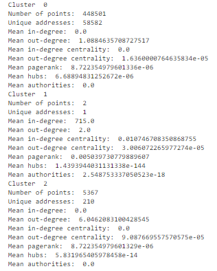

# Exploratory-Data-Analysis-Bounty
note - all the data was collected from the ocean protocol
###  Using the graph based approach
In this method of graph based approach addresses are nodes and transactions are edges.It can be used to get the features such as :-
* In-degree: number of incoming edges for each node
* Out-degree: number of outgoing edges for each node
* In-degree centrality: normalized in-degree of a node
* Out-degree centrality: normalized out-degree of a node
* PageRank: a measure of the importance of a node in a graph
* HITS: a measure of the authority and hubness of a node

I implemented this approach in the Graph.py file where i used the python and its library NetworkX to implement this.
NetworkX is a Python library for the creation, manipulation, and study of the structure, dynamics, and functions of complex networks. It provides data structures for representing graphs, as well as algorithms for graph analysis and visualization.

In this case, NetworkX is being used to create a graph representation of the transactions in the data. Each address is represented as a node, and each transaction is represented as a directed edge from the source address to the target address. This allows us to study the relationships between the addresses in the network, such as the number of incoming and outgoing transactions and the centrality measures of the addresses.

The NetworkX library is useful for this task because it provides a convenient way to represent and manipulate graph data, as well as a variety of algorithms for graph analysis and visualization. This makes it easier to study the patterns in the data and identify any potential sybil attacks.

On applying this approach on the Gitcoin Gr15 data i got this as the analysis:-
   
   

As u can see clearly there are three clusters cluster 0 , cluster 1 and cluster 2. In total there was 453870 transactions from which cluster 0 has 448501 points,cluster 1 has 2 points has 2 and cluster 2 has 5367 points.

As the cluster 0 has so many transactions in it it can't be the sybil attack but the cluster 1 and cluster 2 are kinda suspecious 

The person who did that two transactions in cluster 1 had a address of 0x0 and he did the transaction to the grant_id 7358 

I uploaded the data set i got from this method on ocean protocol [ocean protocol link](https://market.oceanprotocol.com/asset/did:op:b2d554a5e09989bd81f1c54295fafab2a2784fb87ede3390a7103946f65df331)

